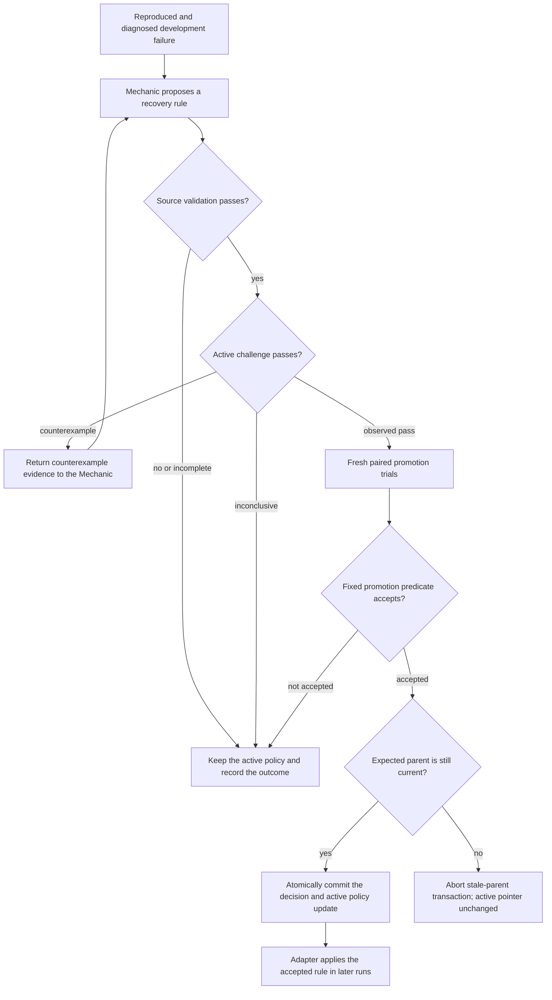

# FaultLab architecture

[Download the LinkedIn graphic](assets/faultlab-architecture.png) · [Original presentation](presentation.pdf)

The assistant upgrades one simulated order and sends a truthful confirmation. Explorer selects faults such as delayed completion or lost responses. Fresh trials reproduce and simplify a failure, then controlled experiments test its cause. Mechanic proposes finite recovery rules, which are tested around the assistant's tool calls through the policy interpreter.

The large return loop shows how accepted rules can reach the adapter for later runs. The smaller feedback loop returns challenge failures to repair development. Explorer selects fault experiments for the mock APIs; the fixed Referee checks actual effects and the original report. The model cannot assign its own passing score. Acceptance requires every declared gate to pass.

W&B Inference supplies the models. Weave records execution traces. Aria provides advisory campaign analysis; it does not alter policies or scores. The dashboard reads saved experiment records.

## How a repair becomes active

The system image above shows the whole loop. This diagram expands the acceptance path in the public implementation: a model proposes a rule, but fixed code decides whether that rule can replace the active policy.

Source validation compares the incumbent and candidate in fresh worlds under the same retained fault. The incumbent must still fail the target check, and the candidate must remove that failure without introducing another. A challenge counterexample becomes development feedback; an inconclusive challenge cannot qualify a repair.

After an observed challenge pass, a separate fresh paired evaluation supplies the promotion evidence. The independent promotion predicate requires matching policy identities, complete repeated evidence, healthy-trial completion, no aggregate regression and a strict observed gain. The decision and active-policy update share one transaction, which checks the expected parent before changing the pointer. A stale parent aborts the transaction. A proposal is therefore not an accepted repair, and an observed challenge pass is not a general robustness guarantee.

Implementation: [learning orchestration](../backend/app/lab/learning.py), [paired evaluation](../backend/app/lab/evaluation.py), [active challenge](../backend/app/lab/challenge.py) and [promotion predicate and commit](../backend/app/lab/promotion.py).

## Recorded status

In recorded campaign `campaign-44085f54a24144b78252d8eea211ebb8`, one candidate passed a three-pair source-validation batch, then failed a harder challenge. The same policy was inconsistent across other batches. No learned repair was accepted. See [learning results](learning-results.md) and [sponsor results](sponsor-results.md) for evidence and limitations.

## Visual production

The system image was created with the built-in image-generation tool using the original presentation as the visual reference. The requested style is a dark background, restrained purple accents, simple icons, a highlighted FaultLab panel, and an explicit whole-system feedback loop. Component icons are illustrations, not official sponsor logos. The diagram describes the architecture, including conditional output paths; it does not claim that policy acceptance or every downstream study has been demonstrated live. The acceptance diagram is maintained as Mermaid text so its decisions can be reviewed against the implementation.
